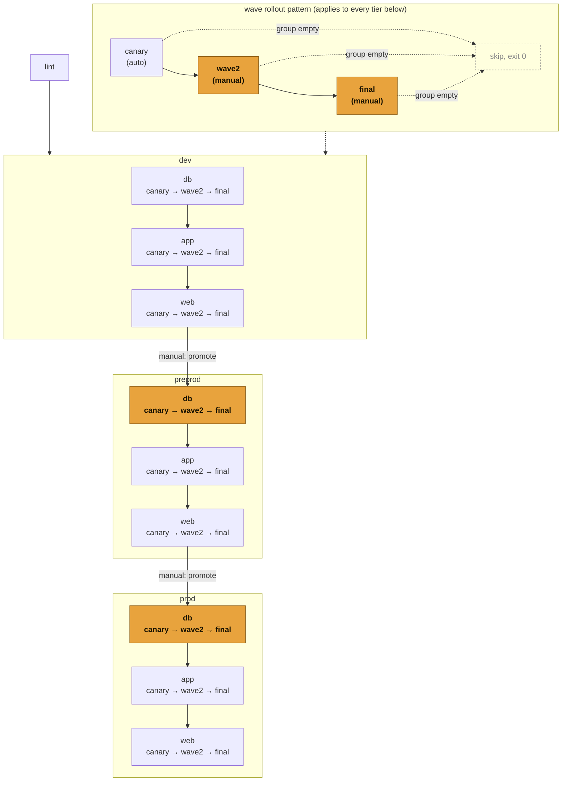

# Pipeline blueprint

Source of truth. Static rendered copy: [wave-rollout-pipeline.html](wave-rollout-pipeline.html).

```mermaid
flowchart TD
    subgraph WAVE["wave rollout pattern (applies to every tier below)"]
        direction LR
        w_canary["canary\n(auto)"] --> w_wave2["wave2\n(manual)"] --> w_final["final\n(manual)"]
        w_canary -.->|"group empty"| w_skip["skip, exit 0"]
        w_wave2 -.->|"group empty"| w_skip
        w_final -.->|"group empty"| w_skip
    end

    lint["lint"] --> DEV

    subgraph DEV["dev"]
        direction LR
        devdb["db\ncanary → wave2 → final"] --> devapp["app\ncanary → wave2 → final"] --> devweb["web\ncanary → wave2 → final"]
    end

    subgraph PREPROD["preprod"]
        direction LR
        ppdb["db\ncanary → wave2 → final"] --> ppapp["app\ncanary → wave2 → final"] --> ppweb["web\ncanary → wave2 → final"]
    end

    subgraph PROD["prod"]
        direction LR
        prdb["db\ncanary → wave2 → final"] --> prapp["app\ncanary → wave2 → final"] --> prweb["web\ncanary → wave2 → final"]
    end

    WAVE -.-> DEV
    devweb -->|"manual: promote"| ppdb
    ppweb -->|"manual: promote"| prdb

    classDef gate fill:#e8a33d,stroke:#8a5a12,color:#1a1300,font-weight:bold;
    classDef skip fill:none,stroke:#888,color:#888,stroke-dasharray: 3 3;
    class w_wave2,w_final,ppdb,prdb gate
    class w_skip skip
```
