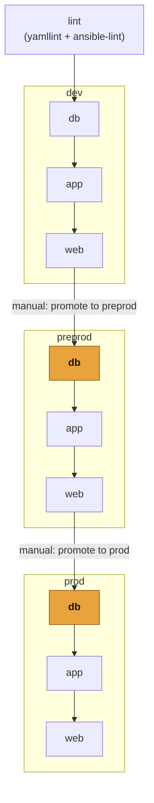
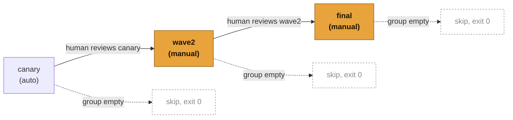

# Pipeline diagram

Source of truth for the wave-rollout gating described in `CLAUDE.md`.

## Environment / tier flow

Each `<tier>` box below is the 3-wave sequence detailed in the next
section. `db:canary` of `preprod`/`prod` is also the environment
promotion gate.

## Wave gating (applies inside every tier box above)

`canary` auto-runs once the previous tier's `final` passes. `wave2` and
`final` always require a human click — even in `dev` — so an issue in
`wave2` can't silently reach `final` unreviewed. A wave targeting an
empty inventory group exits 0 without touching any host.

