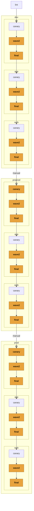

# Pipeline blueprint

```mermaid
flowchart TD
    lint["lint"]

    subgraph DEV["dev"]
        direction TB
        subgraph DEVDB["db"]
            direction LR
            devdb_c["canary"] --> devdb_w["wave2"] --> devdb_f["final"]
        end
        subgraph DEVAPP["app"]
            direction LR
            devapp_c["canary"] --> devapp_w["wave2"] --> devapp_f["final"]
        end
        subgraph DEVWEB["web"]
            direction LR
            devweb_c["canary"] --> devweb_w["wave2"] --> devweb_f["final"]
        end
        devdb_f --> devapp_c
        devapp_f --> devweb_c
    end

    subgraph PREPROD["preprod"]
        direction TB
        subgraph PPDB["db"]
            direction LR
            ppdb_c["canary"] --> ppdb_w["wave2"] --> ppdb_f["final"]
        end
        subgraph PPAPP["app"]
            direction LR
            ppapp_c["canary"] --> ppapp_w["wave2"] --> ppapp_f["final"]
        end
        subgraph PPWEB["web"]
            direction LR
            ppweb_c["canary"] --> ppweb_w["wave2"] --> ppweb_f["final"]
        end
        ppdb_f --> ppapp_c
        ppapp_f --> ppweb_c
    end

    subgraph PROD["prod"]
        direction TB
        subgraph PRDB["db"]
            direction LR
            prdb_c["canary"] --> prdb_w["wave2"] --> prdb_f["final"]
        end
        subgraph PRAPP["app"]
            direction LR
            prapp_c["canary"] --> prapp_w["wave2"] --> prapp_f["final"]
        end
        subgraph PRWEB["web"]
            direction LR
            prweb_c["canary"] --> prweb_w["wave2"] --> prweb_f["final"]
        end
        prdb_f --> prapp_c
        prapp_f --> prweb_c
    end

    lint --> devdb_c
    devweb_f -->|"manual"| ppdb_c
    ppweb_f -->|"manual"| prdb_c

    classDef manual fill:#e8a33d,stroke:#8a5a12,color:#1a1300,font-weight:bold;
    class devdb_w,devdb_f,devapp_w,devapp_f,devweb_w,devweb_f manual
    class ppdb_c,ppdb_w,ppdb_f,ppapp_w,ppapp_f,ppweb_w,ppweb_f manual
    class prdb_c,prdb_w,prdb_f,prapp_w,prapp_f,prweb_w,prweb_f manual
```
